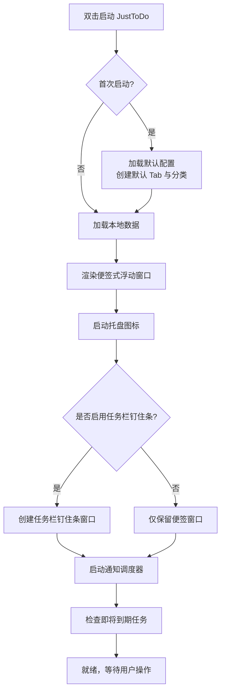
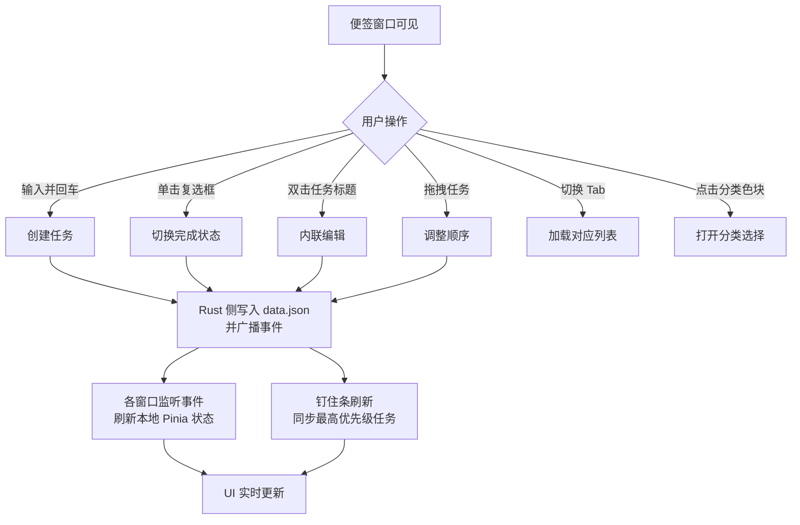
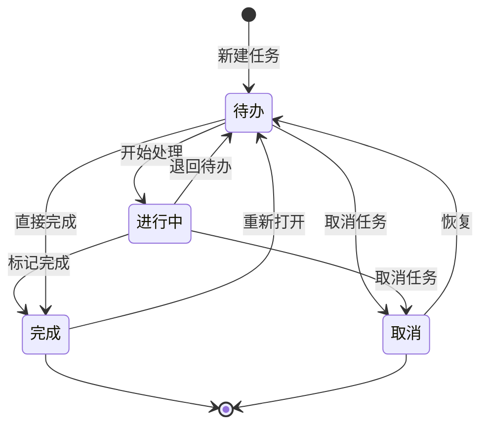

# JustToDo

## 桌面盯人 TODO 软件产品需求文档（PRD）

| 项目 | 内容 |
|------|------|
| 版本 | 1.2 |
| 状态 | Review-Passed (GO) |
| 日期 | 2026/08/20 |
| 产品经理 | Claude（高级产品经理） |

---

## 目录

1. [产品概述](#1-产品概述)
2. [目标用户](#2-目标用户)
3. [核心功能](#3-核心功能)
4. [非功能需求](#4-非功能需求)
5. [用户流程](#5-用户流程)
6. [功能详细规范](#6-功能详细规范)
7. [UI 原型描述](#7-ui-原型描述)
8. [数据模型设计](#8-数据模型设计)
9. [MVP 技术实现拆解](#9-mvp-技术实现拆解)
10. [技术选型建议](#10-技术选型建议)
11. [优先级排序](#11-优先级排序)
12. [里程碑与迭代计划](#12-里程碑与迭代计划)
13. [风险与注意事项](#13-风险与注意事项)
14. [开发就绪度评审记录](#14-开发就绪度评审记录)

---

## 1. 产品概述

**JustToDo** 是一款桌面端常驻盯人式 TODO 工具，专为高效办公和个人生产力设计。

核心理念是 **"盯到桌面"**——让重要信息永远可见、随时可触达。产品提供两种核心形态：

- **便签式浮动窗口**（主力形态，类似物理便签，可拖拽、置顶、调节透明度）
- **任务栏钉住条**（快捷形态，固定显示优先级最高的 TODO，可单击弹出完整列表）

目标用户是上班族、开发者、需要高度专注生产力的个人用户。核心卖点是 **极简 + 常驻 + 盯人**。

---

## 2. 目标用户

- **年龄**：25-45 岁
- **职业**：白领、开发者、自由职业者
- **使用场景**：日常办公、项目管理、个人生活事务跟踪、需要在桌面边工作边盯事的用户
- **痛点解决**：传统 TODO App 容易被窗口管理器挤走或被通知打扰，JustToDo 让重要任务"长驻桌面"。

---

## 3. 核心功能

### 3.1 核心形态（必备）

#### 形态 1：便签式浮动窗口
- 启动后以可见窗口形式出现在桌面右上角（距顶部 20px、距右侧 20px，可拖拽到任意位置；多显示器时默认落在主显示器）
- 支持 **置顶**（Always On Top）
- 支持 **透明度调节**（20%-100%，0% 会使窗口完全不可见故设为下限）
- 支持 **窗口尺寸调节**（宽度 300-800px，高度自适应）
- 支持 **自动隐藏**（鼠标离开窗口 N 秒后，窗口渐隐收缩为屏幕边缘的"半透明小条"，详见 6.1 与 7.5）

#### 形态 2：任务栏钉住条（紧贴任务栏的常驻小窗）
- **真实形态**：一个**紧贴任务栏上边缘**的无边框常驻小窗，浮在任务栏上方（**不是嵌入系统任务栏内部**——Windows 任务栏是系统外壳区域，第三方窗口无法真正钉入；如需嵌入需实现 DeskBand/Explorer 扩展，Tauri 不支持，故不做）
- 支持选择 **左 / 中 / 右** 三档定位（基于任务栏 RECT + 偏移量计算，多显示器时跟随包含任务栏的那个屏幕；详见 6.2、9.3）
- 钉住条只显示 **当前最高优先级的 1-3 个任务**（支持自定义显示数量）
- 钉住条可自定义显示文本（例如"今日最高优先级"）
- 单击钉住条弹出完整列表浮窗
- **Z-order**：钉住条窗口默认与便签窗口同为 Always-On-Top，但不抢占系统任务栏自身层级
- **兜底**：当任务栏被设置为自动隐藏、或定位失败时，钉住条退化为托盘图标的右键菜单"今日要务"（列出最高优先级任务），保证信息不丢失

### 3.2 任务管理

- **添加任务**：输入框回车或按钮添加
- **任务状态**：待办 / 进行中 / 完成 / 取消
- **拖拽排序**：列表内任务可拖拽调整顺序
- **内联编辑**：双击任务标题直接编辑
- **任务颜色**：每个分类可设置独立颜色，任务左侧显示颜色小方块

### 3.3 多 Tab 盯人

- 支持 **多个 Tab**（MVP 至少 3-5 个）
- 每个 Tab 可重命名
- 切换 Tab 时自动加载对应任务列表
- 支持 Tab 右键菜单（重命名、删除、置顶等）

### 3.4 分类 + 优先级

- 支持添加分类（Work / Personal / Study / Shopping / Health / Other）
- 每个分类可设置 **独立颜色**
- 任务支持设置 **优先级**（1-5 星或数字 1-5）
- 优先级最高的任务在列表顶部高亮显示

### 3.5 到期提醒与通知

- 设置任务 **到期日期 + 时间**
- 支持 **提前提醒**（1 小时 / 当天 / 明天 / 自定义时间）
- **桌面原生通知**（Windows Toast + macOS Notification）
- 列表中任务显示"剩余时间 / 已过期"图标
- **去重与补发**：已通知过的任务通过 `notifiedAt` 字段标记，避免重复通知；应用关闭期间错过的"到期提醒"在重启后补发一次，"过期汇总"仅汇总仍未完成的过期任务（详见 6.6、8.1）

### 3.6 搜索与快捷键

- 全局搜索（支持分类、状态、优先级过滤）
- 快捷键支持（**均为应用级**，仅在 JustToDo 窗口聚焦时触发；完整的快捷键表与冲突检测见 6.7）

---

## 4. 非功能需求

- **性能**：启动时间 < 3 秒，列表加载 < 100ms
- **体积**：安装包体积 < 50MB（Tauri 优先）
- **跨平台**：Windows 11 / macOS / Linux（后续；任务栏钉住条仅 Windows 11 原生支持，macOS/Linux 退化为托盘菜单）
- **单实例**：程序仅允许运行一个实例，防止多实例同时写本地数据文件导致冲突（启动时检测并聚焦已有实例）
- **开机自启**：可选开启（设置面板），作为"常驻盯人"应用的核心诉求
- **可访问性**：支持键盘快捷键 + 屏幕阅读器
- **数据持久化**：本地 JSON 文件存储（支持导入/导出）
- **数据安全**：本地存储，不上传云端（隐私优先）
- **数据迁移**：Config 含 `version` 字段，版本升级时执行迁移脚本（详见 8.6）

---

## 5. 用户流程

### 5.1 启动流程



### 5.2 日常使用流程



### 5.3 任务状态机



---

## 6. 功能详细规范

### 6.1 便签式浮动窗口规范

| 交互行为 | 触发方式 | 结果 |
|---------|---------|------|
| 拖拽窗口 | 按住标题栏拖动 | 窗口移动到鼠标位置，松开时记录坐标 |
| 置顶/取消置顶 | 点击标题栏📌图标 | 切换 `setAlwaysOnTop` |
| 调节透明度 | 标题栏齿轮 → 透明度滑块 | 实时调整窗口 alpha 值（**20%-100%**） |
| 调节尺寸 | 拖拽窗口右下角 | 宽度范围 300-800px，高度自适应内容 |
| 自动隐藏 | 设置中开启 + 选择延迟 | 鼠标离开窗口 **N 秒**（N=10/30/60/120 可选）后，窗口渐隐收缩为"半透明小条"（详见下表） |
| 唤回 | 鼠标悬停"半透明小条" / 托盘双击 / 托盘左键单击 | 窗口从"小条"展开恢复显示 |
| 关闭窗口 | 点击❌ | 隐藏到托盘（非退出，非删除） |
| 完全退出 | 托盘右键 → 退出 | 退出程序 |

**窗口默认配置**：
- 初始位置：桌面右上角（距顶部 20px，距右侧 20px）
- 默认尺寸：宽 360px × 高 480px
- 默认透明度：100%
- 默认置顶：开启
- 默认自动隐藏：关闭（用户可选开启）

**"半透明小条"规格**（自动隐藏后的收缩形态）：

| 属性 | 规格 |
|------|------|
| 尺寸 | 200px × 36px |
| 位置 | 原窗口的右下角位置（不跟随鼠标，固定锚点） |
| 透明度 | 30%（鼠标悬停时回升至 70% 提示可展开） |
| 显示内容 | 左：📌 图标；中：未完成任务数（如"5 待办"）；右：最高优先级任务标题前 12 字符 |
| 唤回交互 | 鼠标悬停 0.3 秒自动展开为完整窗口；单击小条立即展开 |
| 边界 | 始终置顶，不被其他窗口遮挡 |

### 6.2 任务栏钉住条规范

> **形态澄清**：钉住条是一个**紧贴任务栏上边缘、浮在任务栏上方**的无边框常驻小窗，**并非嵌入系统任务栏内部**。Windows 任务栏是系统外壳区域，第三方窗口无法真正钉入；本产品以"贴边浮窗 + 置顶"的方式实现"钉住"语义。

| 交互行为 | 触发方式 | 结果 |
|---------|---------|------|
| 定位 | 设置中选择 左/中/右 | 计算 `任务栏RECT`，按档位水平居中对齐到左/中/右三段，垂直贴在任务栏上边缘（详见下方定位算法） |
| 显示数量 | 设置中设置 1-3 | 钉住条只显示前 N 个最高优先级任务 |
| 单击钉住条 | 鼠标左键单击 | 弹出完整列表浮窗（位置紧邻钉住条上方） |
| 右键钉住条 | 鼠标右键 | 弹出菜单（设置 / 切换便签模式 / 退出） |
| 勾选任务 | 在钉住条上点击任务复选框 | 直接标记完成并刷新 |
| 自定义文本 | 设置中输入 | 显示在钉住条顶部，如"📌 今日要务" |

**定位算法（Windows）**：
1. 调用 Win32 API（`SHAppBarMessage` / `GetMonitorInfo`）获取**含任务栏的显示器**的工作区（WorkArea）与任务栏 RECT。
2. 钉住条高度 = 固定（如 96px，含标题 + 最多 3 行任务）；宽度 = 内容自适应或固定（如 320px）。
3. 垂直：底部 = 任务栏顶边 Y 坐标（贴边，不留缝）。
4. 水平三档：
   - 左：`x = WorkArea.Left + 8`
   - 中：`x = WorkArea.Left + (WorkArea.Width - barWidth) / 2`
   - 右：`x = WorkArea.Left + WorkArea.Width - barWidth - 8`
5. 多显示器：优先吸附到主任务栏所在屏幕；若用户显示器无任务栏，则退化为托盘菜单兜底。

**Z-order 处理**：
- 钉住条窗口设为 Always-On-Top，但**不设为"抢焦点"**（`skipTaskbar: true` 且不抢焦点），避免用户正在其他应用输入时被打断。
- 与系统任务栏：钉住条浮在任务栏上方，不改变任务栏本身层级；当用户点击任务栏区域时，钉住条不响应任务栏点击。
- 与其他 Always-On-Top 窗口：钉住条层级 = 便签窗口层级；二者重叠时，最近获得焦点的在上。

**兜底降级**：
- 任务栏自动隐藏（用户开启"自动隐藏任务栏"）→ 钉住条退化为**托盘图标右键菜单**，列出最高优先级 1-3 任务 + "今日要务"分组。
- 定位 API 调用失败 → 同上兜底，并在设置面板提示"钉住条定位失败，已切换为托盘模式"。

**钉住条任务排序规则**：
1. 优先级高 → 低（5 星优先）
2. 同优先级：到期时间近 → 远
3. 无到期时间：创建时间新 → 旧
4. 已完成/取消的任务：不显示

### 6.3 任务管理规范

| 交互行为 | 触发方式 | 结果 |
|---------|---------|------|
| 添加任务 | 输入框输入 + 回车 / 点击➕ | 在当前 Tab 末尾创建待办任务 |
| 勾选完成 | 单击左侧复选框 | 状态切换为完成，划线显示 |
| 内联编辑 | 双击任务标题 | 进入编辑态，回车保存，Esc 取消 |
| 删除任务 | 右键任务 → 删除 / 选中后按 Delete | 任务标记 `deletedAt` 时间戳，移入回收站（软删除）；底部弹出撤销 Toast"已删除，撤销"，5 秒内可撤销（详见 6.8 回收站） |
| 拖拽排序 | 按住任务行拖动 | 调整顺序并保存 |
| 设置优先级 | 右键任务 → 优先级 / 悬停显示⭐ | 1-5 星，影响排序 |
| 设置分类 | 右键任务 → 分类 | 切换分类，更新颜色 |
| 设置到期 | 右键任务 → 到期时间 | 打开日期时间选择器 |
| 打开详情 | 点击任务行（非标题） | 右侧展开详情抽屉 |

### 6.4 Tab 规范

| 交互行为 | 触发方式 | 结果 |
|---------|---------|------|
| 新增 Tab | 点击 Tab 栏 ➕ / Ctrl+N | 创建未命名 Tab 并进入重命名态 |
| 切换 Tab | 单击 Tab 标签 | 加载对应任务列表 |
| 重命名 Tab | 双击 Tab 标签 / 右键→重命名 | 进入编辑态 |
| 删除 Tab | 右键 Tab → 删除 | 二次确认后删除（连同其下任务） |
| 排序 Tab | 拖拽 Tab 标签 | 调整 Tab 顺序 |
| Tab 置顶 | 右键 Tab → 置顶 | 置顶 Tab 固定在最左侧 |

**默认 Tab**：📌 今日要务、💼 工作、🏠 生活

> **Tab 与分类的关系**：Tab 是**列表容器**（按场景/项目划分任务集合，如"工作""生活"），分类是**跨 Tab 的标签**（一个任务无论在哪个 Tab，都可标记为"工作/学习/健康"分类）。二者正交：Tab 决定任务显示在哪个列表，分类决定任务的色彩与归类。

**Tab 颜色**：每个 Tab 可设置独立颜色（显示在 Tab 标签底部下划线，4px）。默认：今日要务=红色 #D0021B、工作=蓝色 #4A90D9、生活=绿色 #7ED321。Tab 颜色仅作视觉区分，不影响任务行颜色（任务行颜色由分类决定）。

### 6.5 分类与颜色规范

**内置分类**（可修改/删除/新增）：

| 分类 | 默认颜色 | 用途 |
|------|---------|------|
| Work 工作 | 🔵 #4A90D9 | 工作相关 |
| Personal 个人 | 🟢 #7ED321 | 个人事务 |
| Study 学习 | 🟣 #9013FE | 学习提升 |
| Shopping 购物 | 🟠 #F5A623 | 采购清单 |
| Health 健康 | 🔴 #D0021B | 健康/运动 |
| Other 其他 | ⚪ #9B9B9B | 其他 |

**颜色显示规则**：
- 任务行左侧显示 4px 宽颜色条
- 任务行背景色 = 分类颜色 × 8% 透明度（淡色背景）
- 优先级 5 星任务标题加粗 + 红色边框提示

### 6.6 通知规范

| 触发条件 | 通知内容 | 行为 |
|---------|---------|------|
| 提前提醒时间到 | 任务标题 + 距离到期时间 | 点击通知 → 聚焦便签窗口并高亮任务 |
| 到期时间到 | "任务已到期：<标题>" | 点击通知 → 聚焦任务 |
| 已过期未完成（每日首次启动汇总） | 汇总"共 N 条任务已过期" | 点击通知 → 跳转到今日 Tab，列表置顶过期任务 |

**通知去重机制**：
- 每个 Task 含 `notifiedAt` 字段（首次成功通知的时间戳）。同一任务的"到期提醒"只发送一次；已发送的不会被轮询重复触发。
- "提前提醒"与"到期时间到"视为**同一条提醒链**：若"提前提醒"已发送（`notifiedAt` 已置位），到达"到期时间"时**不再发**第二条通知；若用户未设提前提醒，则到期时间到时发一次。
- "过期汇总"是每日首次启动的独立通知，**与到期提醒去重无关**——它只汇总当时仍未完成且已过期的任务，不重复提醒单条任务的"到期时间到"。

**通知调度与跨重启补发**：
- 程序启动时扫描所有未完成任务，根据 `dueDate` + `reminderTime` 计算待提醒集合。
- 内存中维护定时器队列；每 60 秒轮询一次兜底，防止定时器丢失。
- **跨重启补发**：应用关闭期间错过的"到期提醒"，重启后对 `dueDate` 已过且 `notifiedAt` 为空的任务**补发一次**通知，随后置位 `notifiedAt`。不批量补发多条历史通知，避免通知轰炸。
- 通知权限被系统禁用时，启动时引导用户开启权限；权限恢复后对未通知任务按上述规则补发。

### 6.7 快捷键规范

> **所有快捷键均为应用级**（仅在 JustToDo 窗口聚焦时触发），避免劫持其他应用的全局快捷键。如未来需要全局呼出（如全局显示/隐藏主窗口），单独列出并做冲突检测。

| 快捷键 | 功能 | 说明 |
|--------|------|------|
| `Ctrl/Cmd + N` | 新建任务（聚焦输入框） | 符合系统"新建"惯例 |
| `Ctrl/Cmd + Shift + T` | 新建 Tab | 避免与系统 Ctrl+T（浏览器新标签页）冲突 |
| `Ctrl/Cmd + F` | 聚焦搜索框 | - |
| `Ctrl/Cmd + 1~9` | 切换到第 N 个 Tab | - |
| `Ctrl/Cmd + Enter` | 将选中任务标记完成 | - |
| `Delete` | 删除选中任务（移入回收站） | 配合撤销 Toast |
| `Ctrl/Cmd + Z` | 撤销上一步操作 | 通用撤销 |
| `Ctrl/Cmd + ↑/↓` | 调整任务优先级 | - |
| `Esc` | 关闭弹窗 / 取消编辑 | - |
| `Ctrl/Cmd + ,` | 打开设置 | macOS 惯例 |
| `Ctrl/Cmd + Shift + M` | 切换便签/钉住条模式 | 避免占用 VS Code 命令面板的 Ctrl+Shift+P |

**冲突检测**：注册应用级快捷键前，前端校验本应用内部无冲突（同一组合键不重复绑定）。全局快捷键（如有）注册时调用系统 API 检测是否被占用，冲突时提示用户自定义。

### 6.8 回收站规范

- **软删除**：删除任务不立即从数据文件移除，而是设置 `deletedAt` 时间戳，并在列表中隐藏。
- **撤销 Toast**：删除后底部弹出"已删除：XX，撤销"，5 秒内点击"撤销"恢复（清除 `deletedAt`）；超时自动消失。
- **回收站入口**：设置面板 → "回收站"按钮，打开回收站视图，列出所有 `deletedAt` 非空的任务，支持"恢复"与"彻底删除"。
- **自动清理**：`deletedAt` 超过 30 天的任务，在启动时被彻底物理删除（删除前自动备份一份到 `backup/`）。
- **回收站容量**：不设硬性上限，依赖 30 天自动清理策略；若 data.json > 5MB 则在启动时提示用户清理。

---

## 7. UI 原型描述

### 7.1 便签式浮动窗口原型

```
┌───────────────────────────────────────┐
│ 📌 JustToDo      🔍 ⚙️ ─ □ ×   <- 标题栏
├───────────────────────────────────────┤
│ [📌今日要务] [💼工作] [🏠生活] [➕]    <- Tab 栏
├───────────────────────────────────────┤
│ 🔍 搜索任务...                        <- 搜索框
├───────────────────────────────────────┤
│ ▌ ☐ 完成产品 PRD 文档      ⭐⭐⭐⭐ ⏰2h  <- 优先级任务
│ ▌ ☐ 准备周会材料          ⭐⭐⭐       │
│ ▌ ☑ 给客户发邮件（划线）              <- 已完成
│   ☐ 回复张三消息          ⭐⭐         │
│ ▌ ☐ 健身 30 分钟  🟢               ⏰过期 ←过期提示
├───────────────────────────────────────┤
│ [➕ 输入新任务并回车...]   全部▼ 工作▼  <- 输入栏 + 过滤
└───────────────────────────────────────┘
   ▲                                ▲
   │左色条=分类色            右侧=优先级⭐+到期⏰
```

### 7.2 任务栏钉住条原型

```
Windows 任务栏：
┌─────────────────────────────────────────────────────────┐
│ [开始] [JustToDo]  [应用1] [应用2] ...        [托盘图标] │
└─────────────────────────────────────────────────────────┘
         ▲
         │
    ┌────────────────────────────────┐
    │ 📌 今日要务                     │ <- 钉住条标题
    │ ▌ ☐ 完成产品 PRD ⭐⭐⭐⭐⭐       │ <- 最高优先级
    │ ▌ ☐ 准备周会材料 ⭐⭐⭐           │
    │ ▌ ☐ 健身 30 分钟 ⏰过期          │
    └────────────────────────────────┘
    单击此处 → 弹出完整列表浮窗
```

### 7.3 任务详情抽屉原型

```
任务行被点击后，右侧滑出详情：
                                  ┌─────────────────────┐
                                  │ 完成产品 PRD 文档  × │ <- 标题
                                  ├─────────────────────┤
                                  │ 状态：进行中  ▼      │
                                  │ 优先级：⭐⭐⭐⭐     │
                                  │ 分类：💼 工作        │
                                  │ 到期：今天 18:00 ⏰  │
                                  ├─────────────────────┤
                                  │ 子任务：             │
                                  │   ☑ 列出功能清单     │
                                  │   ☑ 画 UI 原型       │
                                  │   ☐ 评审会议         │
                                  ├─────────────────────┤
                                  │ 备注：               │
                                  │ ┌─────────────────┐ │
                                  │ │ 这里写详细说明… │ │
                                  │ └─────────────────┘ │
                                  │ 附件：[📎 链接]      │
                                  ├─────────────────────┤
                                  │ [删除]   [保存]      │
                                  └─────────────────────┘
```

### 7.4 设置面板原型

```
┌───────────────────────────────────────┐
│ 设置                            ×     │
├───────────────────────────────────────┤
│ ▸ 窗口与显示                          │
│    置顶            [✅ 开启]          │
│    透明度         [━━━●━━] 80%       │
│    自动隐藏       [✅ 开启] 30s ▼     │
│    开机自启       [☐ 关闭]           │
│ ▸ 任务栏钉住条                       │
│    启用            [✅ 开启]          │
│    位置           [右 ▼]             │
│    显示数量        [3 ▼]             │
│    标题文本        [📌 今日要务]     │
│ ▸ 通知                               │
│    桌面通知        [✅ 开启]          │
│    提醒方式        [提前1小时 ▼]     │
│ ▸ 数据                               │
│    回收站          [打开回收站]      │
│    导出数据        [导出 JSON]       │
│    导入数据        [导入 JSON]       │
└───────────────────────────────────────┘
```

### 7.5 自动隐藏"半透明小条"原型

```
便签窗口（展开态，360×480）            用户鼠标离开 30 秒后渐隐
┌──────────────────────────┐          ┌──────────────────────────┐
│ 📌 JustToDo   🔍 ⚙️ ─ □ × │          │   (窗口已收缩为小条)      │
│ ...                      │  ─────►  └──────────────────────────┘
└──────────────────────────┘
                                              ↓ 收缩为 200×36 小条
                                    ┌──────────────────────┐
                                    │ 📌 5 待办 · 完成PRD… │  <- 30% 透明度，置顶
                                    └──────────────────────┘
                                    鼠标悬停 0.3s → 自动展开恢复
```

---

## 8. 数据模型设计

### 8.1 任务数据结构（Task）

> 所有时间字段统一存 **UTC（ISO 8601，带 `Z`）**，前端展示时按系统本地时区转换，避免跨时区出差提醒错乱。唯一 ID 由 Rust 侧 `uuid` crate 生成 v4。

```json
{
  "id": "task-uuid-v4",
  "title": "完成产品 PRD 文档",
  "status": "todo",          // todo | doing | done | cancelled
  "tabId": "tab-uuid-v4",
  "categoryId": "cat-work",
  "priority": 4,             // 1-5
  "dueDate": "2026-08-20T10:00:00Z",
  "reminderTime": "2026-08-20T09:00:00Z",
  "reminderEnabled": true,
  "notifiedAt": null,         // 首次成功通知的 UTC 时间戳；用于去重与跨重启补发
  "order": 0,                // 列表内排序
  "notes": "补充说明",
  "subtasks": [               // P2 字段，MVP 阶段为空数组占位
    {
      "id": "sub-uuid-v4",
      "title": "列出功能清单",
      "done": true
    }
  ],
  "attachments": [            // P2 字段，MVP 阶段为空数组占位
    { "type": "link", "url": "https://...", "title": "参考文档" }
  ],
  "createdAt": "2026-08-20T02:00:00Z",
  "updatedAt": "2026-08-20T02:30:00Z",
  "completedAt": null,
  "deletedAt": null            // 软删除时间戳（UTC）；非 null 表示在回收站中
}
```

**字段版本说明**：MVP（v1.0.0）阶段 `subtasks`、`attachments` 固定为空数组占位（P2 功能未实现时不禁用字段，保持 schema 稳定）；`notifiedAt`、`deletedAt` 在 MVP 即启用。`reminderTime` 由用户设置的 `dueDate` 与提醒类型自动联动计算（用户改 `dueDate` 时若已设提醒类型则同步重算 `reminderTime`），也可独立手动覆盖。

### 8.2 Tab 数据结构（Tab）

```json
{
  "id": "tab-uuid-v4",
  "name": "📌 今日要务",
  "order": 0,
  "pinned": true,
  "color": "#D0021B",        // Tab 标签底部下划线颜色，默认红/蓝/绿
  "createdAt": "2026-08-20T02:00:00Z"
}
```

### 8.3 分类数据结构（Category）

```json
{
  "id": "cat-work",
  "name": "工作",
  "color": "#4A90D9",
  "icon": "💼",
  "order": 0,
  "isBuiltIn": true
}
```

### 8.4 全局配置（Config）

```json
{
  "window": {
    "x": 1200,
    "y": 20,
    "width": 360,
    "height": 480,
    "alwaysOnTop": true,
    "opacity": 100,            // 20-100（整数，0% 下限避免窗口不可见）
    "autoHide": false,
    "autoHideDelay": 30        // 秒：10/30/60/120
  },
  "taskbar": {
    "enabled": true,
    "position": "right",       // left | center | right
    "visibleCount": 3,
    "title": "📌 今日要务"
  },
  "notification": {
    "enabled": true,
    "reminderType": "1hour",    // 1hour | today | tomorrow | custom
    "soundEnabled": true
  },
  "general": {
    "launchOnStartup": false,   // 开机自启
    "singleInstance": true      // 单实例锁
  },
  "theme": "light",            // light | dark；MVP 固定 light，深色在阶段3
  "version": "1.0.0"
}
```

### 8.5 存储结构（本地文件）

```
%APPDATA%/JustToDo/           (Windows)
~/Library/Application Support/JustToDo/   (macOS)
~/.config/JustToDo/           (Linux)
├── data.json                 // 任务 + Tab + 分类 全量数据
├── config.json               // 全局配置
├── .lock                     // 单实例文件锁（运行时存在）
└── backup/                   // 自动备份（每日 + 删除前）
    ├── data-2026-08-20.json
    └── trash-2026-08-20.json
```

**备份策略**：每日首次启动生成一份 `data-YYYY-MM-DD.json`；保留最近 14 份，超出自动清理最旧的。彻底物理删除回收站任务前，先备份一份 `trash-YYYY-MM-DD.json`。

### 8.6 数据迁移与版本升级

- Config 的 `version` 字段记录当前 schema 版本。
- 版本升级时，启动检测到旧版本 → 执行 `migrate(fromVersion, toVersion)` 迁移脚本链（如 1.0.0 → 1.1.0 → 1.2.0，逐版本应用）。
- 迁移前自动备份当前 `data.json` 到 `backup/pre-migrate-<旧版本>-<时间>.json`。
- MVP v1.0.0 的 `subtasks`/`attachments` 为空数组占位，后续启用子任务时迁移脚本无需变更既有数据结构。

---

## 9. MVP 技术实现拆解

### 9.1 项目目录结构（Tauri + Vue 3）

```
JustToDo/
├── src-tauri/                    # Tauri (Rust) 后端
│   ├── src/
│   │   ├── main.rs               # 入口（单实例锁 + 托盘 + 窗口创建）
│   │   ├── commands/             # Tauri 命令
│   │   │   ├── window.rs         # 窗口控制（置顶/透明度/自动隐藏）
│   │   │   ├── storage.rs        # 本地存储读写（单一数据源）
│   │   │   ├── taskbar.rs        # 任务栏钉住条（Win32 RECT 定位 + 兜底）
│   │   │   ├── notification.rs   # 通知调度（去重 + 跨重启补发）
│   │   │   └── trash.rs          # 回收站（软删除/恢复/清理）
│   │   ├── events.rs             # 事件总线（emit 广播变更）
│   │   ├── migrate.rs            # 数据迁移
│   │   └── models.rs             # Rust 数据模型
│   ├── tauri.conf.json           # Tauri 配置（多窗口定义）
│   └── Cargo.toml
├── src/                          # Vue 3 前端
│   ├── App.vue
│   ├── main.ts
│   ├── windows/                  # 每个窗口一个入口页
│   │   ├── sticky.html / sticky.ts   # 便签窗口入口
│   │   ├── taskbar.html / taskbar.ts  # 钉住条窗口入口
│   │   └── popup.html / popup.ts      # 完整列表浮窗入口
│   ├── components/
│   │   ├── StickyWindow.vue      # 便签式浮动窗口
│   │   ├── TaskbarPinned.vue      # 任务栏钉住条
│   │   ├── TaskList.vue           # 任务列表
│   │   ├── TaskItem.vue           # 单个任务行
│   │   ├── TabBar.vue             # Tab 切换栏
│   │   ├── TaskDetail.vue         # 任务详情抽屉（P2）
│   │   ├── SearchBar.vue          # 搜索框
│   │   ├── SettingsPanel.vue      # 设置面板
│   │   ├── TrashView.vue          # 回收站视图
│   │   ├── UndoToast.vue          # 撤销提示
│   │   └── NotificationHost.vue   # 应用内兜底通知展示
│   ├── stores/                   # Pinia 状态管理（每窗口独立实例）
│   │   ├── taskStore.ts          # 任务状态
│   │   ├── tabStore.ts           # Tab 状态
│   │   └── configStore.ts        # 配置状态
│   ├── composables/
│   │   └── useDataSync.ts        # 跨窗口同步（listen 事件 + 拉取）
│   ├── types/                    # TypeScript 类型定义
│   │   └── index.ts
│   └── utils/
│       ├── storage.ts            # 存储工具（调 Tauri command）
│       └── shortcuts.ts          # 应用级快捷键注册
├── package.json
└── JustToDo-PRD.md               # 本文档
```

### 9.2 功能与文件映射

| 功能模块 | 前端文件 | 后端文件 (Rust) | 核心技术点 |
|---------|---------|----------------|-----------|
| 便签窗口 | `StickyWindow.vue` | `commands/window.rs` | `setAlwaysOnTop` / `setOpacity` / 自动隐藏定时器 |
| 任务栏钉住条 | `TaskbarPinned.vue` | `commands/taskbar.rs` | 多窗口 + Win32 任务栏 RECT 定位 + 兜底降级 |
| 任务列表 | `TaskList.vue` + `TaskItem.vue` | - | 拖拽（vuedraggable） |
| Tab 管理 | `TabBar.vue` | - | Pinia 状态切换 |
| 分类/颜色管理 | `TaskItem.vue` + 设置页 | - | 分类配置 |
| 通知调度 | `NotificationHost.vue` + `composables` | `commands/notification.rs` | 平台原生通知 + `notifiedAt` 去重 |
| 回收站 | `TrashView.vue` + `UndoToast.vue` | `commands/trash.rs` | 软删除 + 30 天清理 |
| 跨窗口同步 | `composables/useDataSync.ts` | `events.rs` | Tauri `emit`/`listen` 事件总线 |
| 本地存储 | `utils/storage.ts` | `commands/storage.rs` | JSON 读写 + 自动备份 |
| 快捷键 | `utils/shortcuts.ts` | - | 应用级快捷键 + 冲突检测 |
| 设置 | `SettingsPanel.vue` | `commands/storage.rs` | 配置持久化 |
| 数据迁移 | - | `migrate.rs` | 版本号驱动迁移脚本链 |

### 9.3 核心技术难点与方案

1. **置顶窗口**：Tauri `Window::set_always_on_top(true)`
2. **透明度调节**：Tauri `Window::set_opacity(0.2-1.0)`（macOS 支持良好，Windows 需 WS_EX_LAYERED；下限 20%）
3. **任务栏钉住条**：创建独立无边框小窗口，通过 Win32 `SHAppBarMessage`/`GetMonitorInfo` 获取任务栏 RECT，按 6.2 算法定位到左/中/右三段并贴任务栏上边缘；`skipTaskbar: true` 不抢焦点；任务栏自动隐藏或定位失败时退化为托盘菜单
4. **托盘**：Tauri `tray` 插件；钉住条兜底也通过托盘右键菜单"今日要务"展示
5. **通知**：Tauri `notification` 插件；`notifiedAt` 字段去重，启动时补发一次错过的到期提醒
6. **拖拽排序**：前端 `vuedraggable` / `@vueuse/integrations`
7. **数据持久化**：Rust 侧读写 JSON，前端通过 Tauri command 调用；写入后广播事件
8. **单实例**：启动时获取 `.lock` 文件锁，已存在则聚焦已有窗口并退出

### 9.4 多窗口状态同步架构（核心）

> Tauri 中每个窗口是独立 webview，拥有独立 JS 上下文，**Pinia store 无法跨窗口共享**。因此采用 **Rust 侧单一数据源 + Tauri 事件总线** 架构。

**架构**：
- **Rust 侧**：`storage.rs` 持有全部数据的单一可信源（data.json）。所有写操作经 Tauri command 落到 Rust，Rust 写盘后通过 `app.emit(event, payload)` 向所有窗口广播变更事件。
- **前端各窗口**：各自维护独立 Pinia store；启动时通过 command 拉取全量数据；运行中通过 `listen(event)` 订阅变更，增量更新本地 store，再驱动 UI 渲染。

**事件协议**（Rust 广播，前端订阅）：

| 事件名 | payload | 订阅方 | 说明 |
|--------|---------|--------|------|
| `task:created` | `{ task: Task }` | 便签窗口、钉住条 | 新增任务 |
| `task:updated` | `{ task: Task }` | 便签窗口、钉住条 | 任务字段变更（状态/优先级/到期等） |
| `task:deleted` | `{ id, deletedAt }` | 便签窗口、钉住条 | 软删除 |
| `task:restored` | `{ id }` | 便签窗口、钉住条 | 从回收站恢复 |
| `tab:changed` | `{ tabs: Tab[] }` | 便签窗口 | Tab 增删/重命名/排序 |
| `config:changed` | `{ config: Config }` | 所有窗口 | 配置变更（如钉住条数量） |
| `request:refresh` | `{ scope }` | 所有窗口 | 全量重拉兜底（每 60s 触发一次防漏） |

**写入冲突策略**：采用**乐观锁**——每次写操作携带任务的 `updatedAt`；Rust 侧比对，若服务端 `updatedAt` 更新则拒绝并返回冲突，前端提示"该任务已被其他窗口修改，已刷新"。因单用户单机操作，冲突概率极低，乐观锁足以。

---

## 10. 技术选型建议

**推荐技术栈**：

- **前端**：Vue 3 + Composition API + TypeScript
- **状态管理**：Pinia（每窗口独立实例，跨窗口同步走 9.4 事件总线）
- **桌面框架**：**Tauri**（强烈推荐）或 Electron
- **通知**：Tauri `notification` 插件
- **窗口控制**：Tauri `window` API（`setAlwaysOnTop` / `setOpacity`）
- **拖拽**：vuedraggable
- **构建工具**：Vite

**选 Tauri 的理由**：安装包 < 10MB、内存占用低、原生性能好、安全模型完善；Electron 包体大（> 80MB）但生态更成熟，作为备选。

**Tauri vs Electron 取舍说明**（针对本产品关键能力）：

| 能力 | Tauri | Electron | 结论 |
|------|-------|----------|------|
| 窗口置顶 | 原生支持 | 原生支持，更稳定 | 平 |
| 窗口透明度（Win） | 需 WS_EX_LAYERED 手动处理 | `setOpacity` 更稳定 | Electron 略优 |
| 多窗口 + 事件总线 | `emit`/`listen` | IPC + `webContents.send` | 平 |
| 任务栏 RECT 定位 | 需 Rust + Win32 crate | 需 Node + `ffi-napi` | 平（都要原生 API） |
| 包体积 | < 10MB | > 80MB | Tauri 胜 |
| 跨平台一致性 | 平台差异需处理 | Chromium 一致 | Electron 胜 |

> **决策**：MVP 选 Tauri（体积与性能符合"轻量常驻"定位）。若后续发现 Windows 透明度/钉住条稳定性不足，可评估迁移 Electron——因数据层为纯 JSON，迁移成本主要在窗口控制层。

---

## 11. 优先级排序

| 优先级 | 功能模块 | 说明 |
|--------|----------------------|----------------------|
| P0 | 便签式浮动窗口（置顶/拖拽/透明度/自动隐藏/半透明小条） | 核心形态，必须 |
| P0 | 任务栏钉住条（贴任务栏浮窗 + 兜底降级） | 核心补充形态 |
| P0 | 多 Tab + 分类 + 颜色 + 优先级 | 核心盯人功能 |
| P0 | 添加/勾选/软删除 + 拖拽排序 | 基础功能 |
| P0 | 本地 JSON 存储 + 自动备份 + 单实例 | 数据基座 |
| P0 | 搜索 + 快捷键（应用级 + 冲突检测） | 可用性，纳入 MVP |
| P0 | 托盘图标 + 开机自启 | 常驻诉求 |
| P1 | 到期提醒 + 桌面原生通知（去重 + 补发） | 桌面端差异化卖点 |
| P1 | 回收站 + 撤销 Toast | 数据安全 |
| P1 | 设置面板 | 配置入口 |
| P2 | 任务详情 + 子任务 + 附件 | 进阶功能 |
| P3 | 看板视图（按分类分组） | 视图切换（功能定义见 3.x，MVP 不实现） |
| P3 | 主题（深色/浅色） | 后期功能 |
| P3 | 完成率统计 | 后期功能 |
| P3 | 导入/导出 JSON | 数据迁移（设置面板按钮预留） |

---

## 12. 里程碑与迭代计划

### 阶段 1：MVP（4-6 周）

**目标**：核心形态可用，能在桌面盯人

- [ ] 便签式浮动窗口（置顶、拖拽、透明度 20-100%、自动隐藏 + 半透明小条）
- [ ] 任务栏钉住条（贴任务栏浮窗定位、显示最高优先级、单击弹出、兜底降级）
- [ ] 多 Tab + 分类 + 颜色 + 优先级
- [ ] 添加/勾选/软删除/拖拽排序
- [ ] 本地 JSON 存储 + 自动备份 + 单实例锁
- [ ] 搜索 + 应用级快捷键 + 冲突检测
- [ ] 托盘图标 + 开机自启
- [ ] 跨窗口状态同步（事件总线）

### 阶段 2：提醒与回收站（2-3 周）

**目标**：通知差异化 + 数据安全完善

- [ ] 到期提醒 + 桌面原生通知（`notifiedAt` 去重 + 跨重启补发）
- [ ] 回收站视图 + 撤销 Toast（30 天自动清理）
- [ ] 设置面板（窗口/钉住条/通知/数据）
- [ ] 数据迁移框架

### 阶段 3：详情与视图（2 周）

**目标**：进阶功能完善

- [ ] 任务详情抽屉（子任务、备注、附件）
- [ ] 看板视图（按分类分组）
- [ ] 主题（深色/浅色）
- [ ] 导入/导出 JSON

### 阶段 4：优化与扩展（持续）

- [ ] 跨平台适配（macOS / Linux；钉住条平台降级）
- [ ] 完成率统计
- [ ] 性能优化
- [ ] 云同步（可选，后期）
- [ ] 快捷键自定义

> **钉住条风险预案**：阶段 1 的"任务栏钉住条"是 P0 中技术风险最高项。建议在阶段 1 第 1 周先做一次**技术 Spike**（验证 Win32 任务栏 RECT 定位 + Tauri 多窗口 + 兜底降级），Spike 通过则继续 P0；不通过则临时降级为 P1（仅托盘菜单展示最高优先级），不阻塞便签窗口主线开发。

---

## 13. 风险与注意事项

### 13.1 技术风险

| 风险 | 影响 | 应对方案 |
|------|------|---------|
| 窗口透明度在 Windows 表现不一致 | 透明度功能体验差 | 使用 WS_EX_LAYERED + 手动实现；下限 20% 避免窗口消失 |
| 任务栏钉住条无法真正嵌入任务栏 | 钉住条形态与预期不符 | 已澄清为"贴任务栏上边缘的置顶浮窗"（6.2）；定位失败/自动隐藏时退化为托盘菜单兜底；阶段 1 首周技术 Spike 验证 |
| 多窗口状态同步 | 数据不一致 | 采用 Rust 单一数据源 + Tauri 事件总线架构（9.4），每窗口独立 Pinia + `listen` 订阅；写冲突用乐观锁；60s 全量刷新兜底 |
| 通知权限被系统禁用 | 通知不触发 | 启动时检测权限并引导开启；`NotificationHost.vue` 应用内兜底提醒；权限恢复后补发 |
| 通知重复/漏发 | 打扰用户或漏掉提醒 | `notifiedAt` 字段去重；跨重启补发一次；过期汇总与到期提醒分离 |
| Tauri 跨平台 API 差异 | 部分功能在某平台失效 | 钉住条仅 Windows 原生支持，macOS/Linux 降级为托盘菜单；优先 Windows 适配，按平台条件编译 |
| 数据文件损坏 | 数据丢失 | 启动时校验 JSON 完整性，损坏则回滚到最近备份；每日备份 + 迁移前备份 |

### 13.2 产品风险

| 风险 | 影响 | 应对方案 |
|------|------|---------|
| 功能过多导致臃肿 | 偏离"极简"定位 | 严格按优先级，P0 先做透；P2/P3 默认不实现 |
| 与系统便签/TODO 工具竞争 | 用户留存难 | 突出"双形态盯人 + 任务栏最高优先级常驻"差异化卖点 |
| 数据丢失 | 用户信任崩塌 | 软删除 + 回收站 + 自动备份（每日 14 份）+ 导出 + 操作撤销 |
| 跨平台承诺过宽 | 钉住条在 mac/Linux 无法实现 | 明确钉住条为 Windows 特性，其他平台降级，不承诺完全一致 |

### 13.3 合规与隐私

- 所有数据本地存储，不上传云端
- 通知不包含敏感任务内容（可选脱敏显示）
- 遵循各平台通知权限规范

---

## 14. 开发就绪度评审记录

> 本节记录 v1.2 基于开发就绪度评审的修复情况。评审原报告见 `JustToDo-REVIEW.md`。

### 14.1 阻断项（Blockers）修复情况

| 编号 | 问题 | 修复 | 位置 |
|------|------|------|------|
| B1 | 任务栏钉住条可行性/定义不成立 | 重定义为"贴任务栏上边缘的置顶浮窗"，补充定位算法、Z-order、多显示器、兜底降级 | 3.1、6.2、9.3、13.1 |
| B2 | 多窗口状态同步方案技术错误（Pinia 跨窗口） | 新增 9.4 架构：Rust 单一数据源 + Tauri 事件总线 + 乐观锁；修正 13.1 | 5.2、9.4、13.1 |
| B3 | 窗口初始位置自相矛盾（左上 vs 右上） | 统一为"右上角，距顶 20px 距右 20px"，删除"最小化到左上角" | 3.1、6.1 |
| B4 | 自动隐藏行为未定义、引入未定义"半透明小条" | 合并定时/鼠标离开机制，定义小条规格（200×36/30%/唤回），补原型 7.5 | 3.1、6.1、7.5 |
| B5 | 回收站数据模型与 UI 缺失 | Task 增 `deletedAt`；新增 6.8 回收站规范 + 7.4 入口 + `TrashView.vue` | 6.3、6.8、7.4、8.1、9.x |

### 14.2 重要项（Major）修复情况

| 编号 | 问题 | 修复 |
|------|------|------|
| M1 | 透明度范围三处不一致 | 统一为 20%-100%，Config 存整数 20-100，UI 滑块标注一致 |
| M2 | 功能映射表"通知调度"误指 SearchBar.vue | 改为 `NotificationHost.vue` + composables |
| M3 | 优先级表与功能/里程碑不一致 | 重排优先级表（搜索+快捷键入 P0），看板视图标注 MVP 不实现，导入/导出降为 P3 预留按钮 |
| M4 | 快捷键冲突 + 全局/应用级未区分 | 重新设计快捷键（Ctrl+N 新建任务、Ctrl+Shift+T 新建 Tab、Ctrl+Shift+M 切模式），明确应用级 + 冲突检测 |
| M5 | Tab.color 字段功能未定义 | 补充 Tab 颜色用途（下划线，默认红/蓝/绿）与分类颜色关系说明 |
| M6 | 数据模型含 P2 字段无版本说明 | 标注 MVP 阶段为空数组占位，schema 稳定；新增 8.6 迁移机制 |
| M7 | 通知去重与跨重启逻辑缺失 | Task 增 `notifiedAt`，6.6 定义去重规则与跨重启补发策略 |
| M8 | MVP 范围对钉住条风险评估不足 | 阶段 1 首周技术 Spike，不通过则降级为 P1，不阻塞主线 |

### 14.3 次要项处理

- UUID 策略：明确 Rust `uuid` crate v4（8.1）
- 时区：统一存 UTC，展示按本地时区（8.1）
- 主题字段：标注 MVP 固定 light（8.4）
- Tab 与分类关系：补充正交说明（6.4）
- 单实例 + 开机自启：纳入非功能需求（4）与配置（8.4）
- 备份保留策略：14 份滚动（8.5）
- `reminderTime` 与 `dueDate` 联动：补充编辑联动说明（8.1）
- 附件类型：标注 MVP 仅 link 占位（8.1）

### 14.4 评审建议的"未决问题"答复

1. **Electron vs Tauri**：已新增 10 取舍表，MVP 选 Tauri，保留迁移评估。
2. **"盯人"成功指标**：本次不设量化指标（个人工具），后续若商业化再补充。
3. **跨平台钉住条**：明确为 Windows 特性，mac/Linux 降级托盘（13.1）。
4. **任务量级**：预期单用户 < 1000 条；列表用虚拟滚动（阶段 4 优化），搜索走内存过滤。

---

## 附录：版本历史

| 版本 | 日期 | 变更 |
|------|------|------|
| 1.0 | 2026/08/20 | 初版 PRD |
| 1.1 | 2026/08/20 | 补充功能详细规范、UI 原型、数据模型、技术拆解、风险与里程碑 |
| 1.2 | 2026/08/20 | 基于开发就绪度评审，修复 5 个阻断项 + 8 个重要项 + 次要项；新增多窗口同步架构（9.4）、回收站（6.8）、钉住条定位算法（6.2）、半透明小条规格（6.1/7.5）、数据迁移（8.6）、评审记录（14）|
